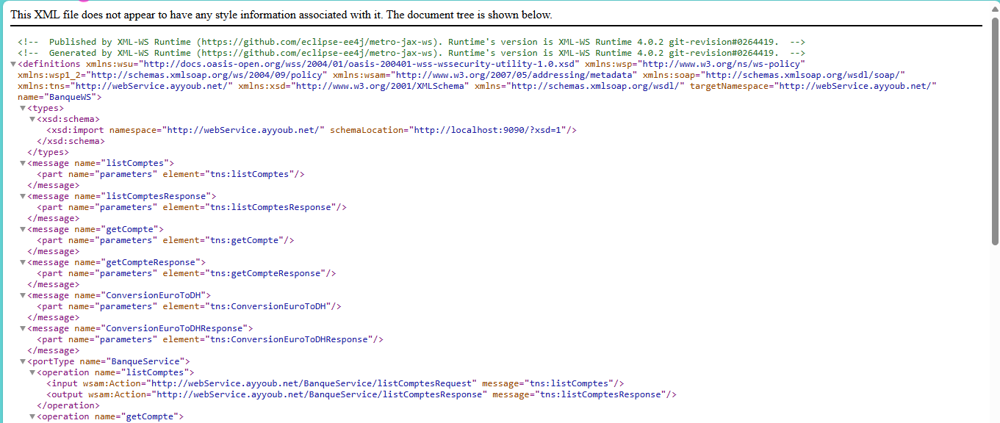
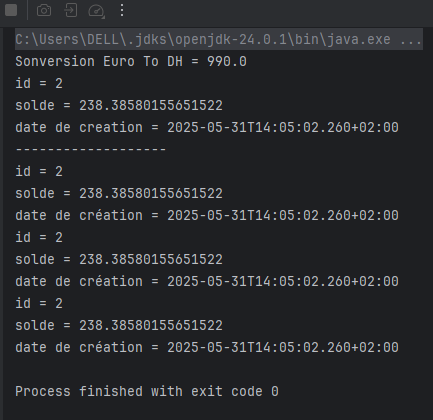
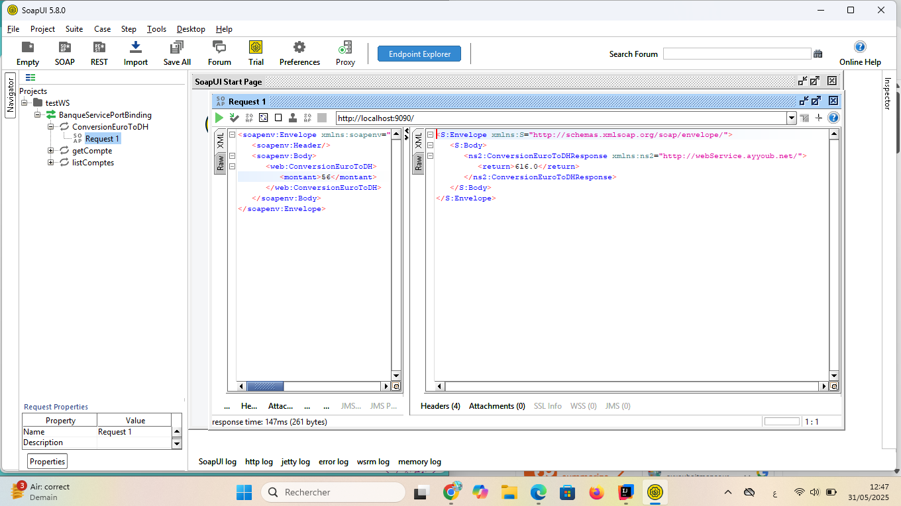
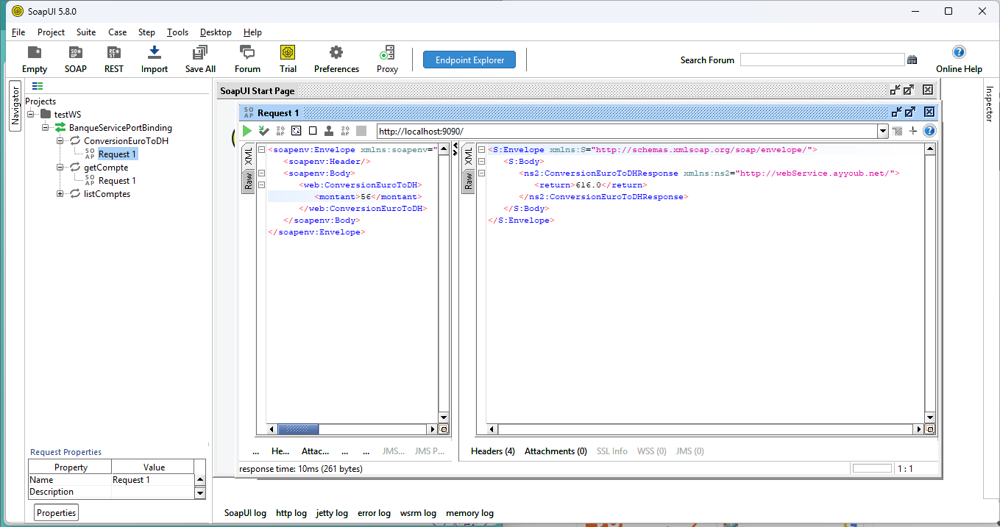
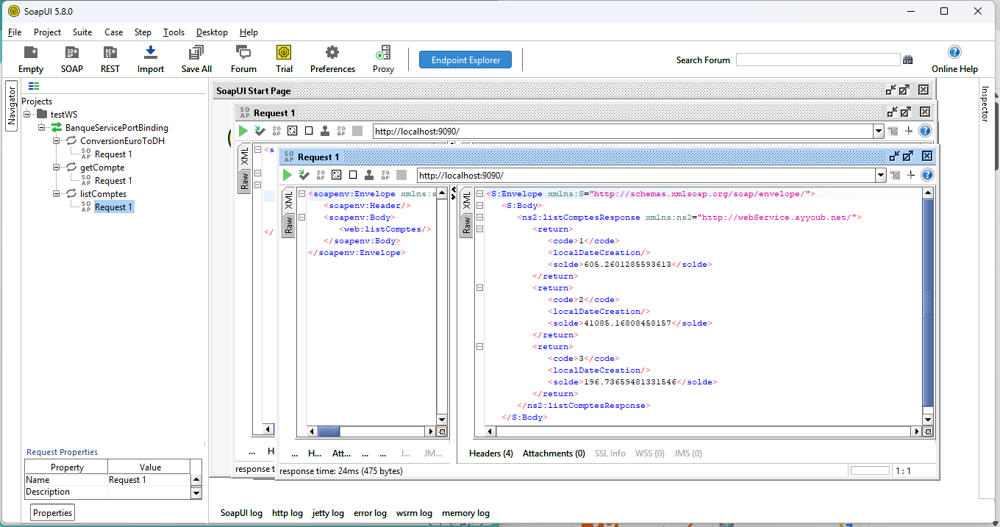

# Projet Service Web Bancaire - Architecture Client-Serveur SOAP
## 👨‍💻 Auteur

**Ayyoub ait mansour ** - Développeur

---

## 📋 Description du Projet

Ce projet est composé de **deux applications distinctes** qui implémentent une architecture client-serveur basée sur les services web SOAP pour la gestion de comptes bancaires.

## 🏗️ Architecture Globale

### Projet 1 : Service Web SOAP (Serveur)
**Répertoire** : `webService_soap2/`

Le serveur expose les services bancaires via SOAP et génère automatiquement le WSDL.

### Projet 2 : Client Java (Consommateur)
**Répertoire** : `client_WebService/`

Le client utilise le code Java généré automatiquement à partir du WSDL pour consommer les services.

## 🔧 Projet 1 - Service Web SOAP (Serveur)

### Structure du Serveur
```
webService_soap2/
├── src/
│   └── main/
│       └── java/
│           └── net/
│               └── ayyoub/webService/
│                   ├── BanqueService.java    # Interface du service
│                   ├── Compte.java           # Entité Compte
│                   └── tp3/
│                       └── ServeurJWS.java  # Serveur JAX-WS
├── pom.xml
└── README.md
```

### Services Exposés

1. **listComptes()** : Retourne la liste de tous les comptes
2. **getCompte(int code)** : Récupère un compte par son ID
3. **conversionEuroToDH(double montant)** : Convertit Euros vers Dirhams

### Configuration du Serveur

```java
// ServeurJWS.java
public class ServeurJWS {
    public static void main(String[] args) {
        Endpoint.publish("http://0.0.0.0:9090/", new BanqueService());
        System.out.println("Web Service déployé sur http://localhost:9090/");
    }
}
```

### WSDL Généré
- **URL** : `http://0.0.0.0:9090/?wsdl`



## 🖥️ Projet 2 - Client Java (Consommateur)

### Structure du Client
```
client_WebService/
├── src/
│   └── main/
│       └── java/
│           └── net/tp3/
│               ├── Main.java              # Client principal
│               └── proxy/                 # Code généré depuis WSDL
│                   ├── BanqueService.java
│                   ├── BanqueWS.class
│                   ├── Compte.class
│                   ├── ConversionEuroToDH.class
│                   ├── ConversionEuroToDHResponse.class
│                   ├── GetCompte.class
│                   ├── GetCompteResponse.class
│                   ├── ListComptes.class
│                   └── ListComptesResponse.class
├── pom.xml
└── README.md
```

### Génération du Code Client

Le code client est généré automatiquement à partir du WSDL avec l'outil `wsimport` :


### Code Client Principal

```java
public class Main {
    public static void main(String[] args) {
        // Création du proxy
        BanqueService proxy = new BanqueWS().getBanqueServicePort();
        
        // Test conversion Euro vers DH
        System.out.println("Conversion Euro To DH = " + proxy.conversionEuroToDH(100));
        
        // Test récupération d'un compte
        Compte compte = proxy.getCompte(2);
        System.out.println("id = " + compte.getCode());
        System.out.println("solde = " + compte.getSolde());
        System.out.println("date de création = " + compte.getDateCreation());
        
        // Test liste des comptes
        List<Compte> comptes = proxy.listComptes();
        comptes.forEach(c -> {
            System.out.println("id = " + c.getCode());
            System.out.println("solde = " + c.getSolde());
            System.out.println("date de création = " + c.getDateCreation());
        });
    }
}
```




## 🧪 Tests avec SoapUI

### Configuration SoapUI
- **Endpoint** : `http://0.0.0.0:9090/`
- **WSDL** : `http://localhost:9090/BanqueWS?wsdl`


### Test du Service listComptes





## 👨‍💻 Auteur

**Ayyoub ait mansour ** - Développeur

---


*Architecture Client-Serveur SOAP - Mai 2025*
